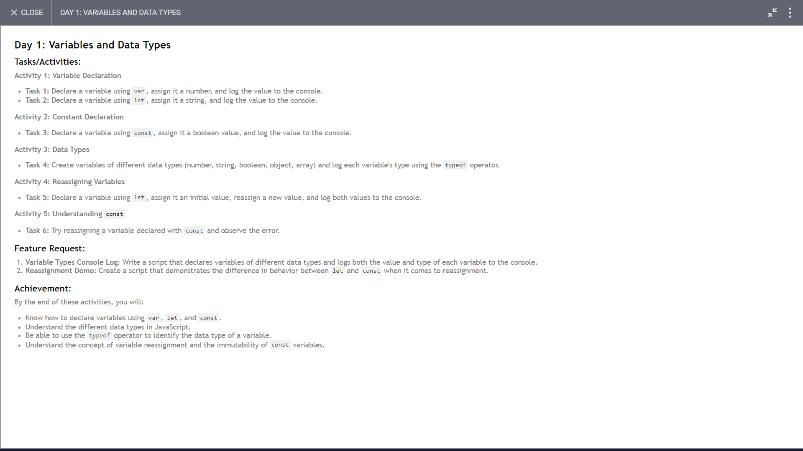

# Day 1 



### FEATURE 1: >> Log all data types in the console with their respective value;

```

//                ***** Activity 3: Data Types  ******
const fName = 'Mohit'
const age = 21;
const isAuthor = true;
const fullDetails = {
    name:"Mohit",
}
const array = [1,2,3];

console.log(fName, "is the typeOf = ", typeof fName)  // String
console.log(age, "is the typeOf = ", typeof age)  // Number
console.log(isAuthor, "is the typeOf = ", typeof isAuthor)  // Boolean
console.log(fullDetails, "is the typeOf = ", typeof fullDetails)  // Object
console.log(array, "is the typeOf = ", typeof array) // Object

```

### FEATURE 2: >> Different between let and const

```
let initialValue = 20;
console.log(initialValue) // output => 20
initialValue = 'Update value';
console.log(initialValue)  // output => 'Update value'

const constReassignment = 'initial value' 
console.log(constReassignment) // output => initial value
// constReassignment = 'Try change' // output -> TypeError: Assignment to constant variable.

```

## Note:-


- We can **reassign** the variable that created usign '**Let**'
- We **can't** reassign the variable that created usign '**const**'
- We can **saperate Declaration and Assignment** of the variable that created usign 'let'
- We **can't saperate Declaration and Assignment** of the variable that created usign 'const' means const variable must be initialize with a value. (can't update in future)  

- *Array is the special type of object* that's why we got **typeOf array == 'Object'**.
